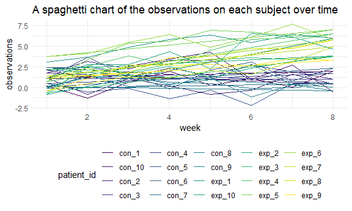

p8105\_hw5\_rw2844
================
Renjie Wei
11/12/2020

## Problem 1

Read in the data.

``` r
homicide_df = 
  read_csv("homicide-data/homicide-data.csv") %>% 
  mutate(
    city_state = str_c(city, state, sep = ", "),
    resolved = case_when(
      disposition == "Closed without arrest" ~ "unsolved",
      disposition == "Open/No arrest"        ~ "unsolved",
      disposition == "Closed by arrest"      ~ "solved",
    )
  ) %>% 
  select(city_state, resolved) %>% 
  filter(city_state != "Tulsa, AL")
```

    ## 
    ## -- Column specification --------------------------------------------------------
    ## cols(
    ##   uid = col_character(),
    ##   reported_date = col_double(),
    ##   victim_last = col_character(),
    ##   victim_first = col_character(),
    ##   victim_race = col_character(),
    ##   victim_age = col_character(),
    ##   victim_sex = col_character(),
    ##   city = col_character(),
    ##   state = col_character(),
    ##   lat = col_double(),
    ##   lon = col_double(),
    ##   disposition = col_character()
    ## )

Summarize the total number of unsolved cases in each of the cities.

``` r
aggregate_df = 
  homicide_df %>% 
  group_by(city_state) %>% 
  summarize(
    hom_total = n(),
    hom_unsolved = sum(resolved == "unsolved")
  )
```

    ## `summarise()` ungrouping output (override with `.groups` argument)

Do a prop test for Baltimore, MD.

``` r
prop.test(
  aggregate_df %>% filter(city_state == "Baltimore, MD") %>% pull(hom_unsolved), 
  aggregate_df %>% filter(city_state == "Baltimore, MD") %>% pull(hom_total)) %>% 
  broom::tidy()
```

    ## # A tibble: 1 x 8
    ##   estimate statistic  p.value parameter conf.low conf.high method    alternative
    ##      <dbl>     <dbl>    <dbl>     <int>    <dbl>     <dbl> <chr>     <chr>      
    ## 1    0.646      239. 6.46e-54         1    0.628     0.663 1-sample~ two.sided

Run prop.test for each of the cities in the dataset.

``` r
results_df = 
  aggregate_df %>% 
  mutate(
    prop_tests = map2(.x = hom_unsolved, .y = hom_total, ~prop.test(x = .x, n = .y)),
    tidy_tests = map(.x = prop_tests, ~broom::tidy(.x))
  ) %>% 
  # extract both the proportion of unsolved homicides and the confidence interval for each
  select(-prop_tests) %>% 
  unnest(tidy_tests) %>% 
  select(city_state, estimate, conf.low, conf.high)
```

Create a plot that shows the estimates and CIs for each city.

``` r
results_df %>% 
  mutate(city_state = fct_reorder(city_state, estimate)) %>% 
  ggplot(aes(x = city_state, y = estimate)) +
  geom_point() + 
  geom_errorbar(aes(ymin = conf.low, ymax = conf.high)) + 
  theme(axis.text.x = element_text(angle = 90, vjust = 0.5, hjust = 1))
```


## Problem 2

Create a tidy dataframe containing data from all participants, including
the subject ID, arm, and observations over time

``` r
lda_df = 
  tibble(
    file = list.files("lda_data"),
  ) %>% 
  mutate(
    path = str_c("lda_data/", file),
    # read in data now
    data = map(path, read_csv)
    ) %>% 
  unnest(data) %>% 
  # extract the group and id
  mutate(
    label = str_extract(file, "(exp_[0-9][0-9]|con_[0-9][0-9])"),
  ) %>% 
  separate(
    label,
    into = c("arm","id"),
    sep = "_"
  ) %>% 
  pivot_longer(
    week_1:week_8,
    names_to = "week",
    values_to = "observations",
    names_prefix = "week_"
  ) %>% 
  mutate(
    arm = as.factor(arm),
    id = as.numeric(id),
    week = as.numeric(week),
    observations = as.numeric(observations)
  ) %>% 
  select(-file,-path)
```

    ## 
    ## -- Column specification --------------------------------------------------------
    ## cols(
    ##   week_1 = col_double(),
    ##   week_2 = col_double(),
    ##   week_3 = col_double(),
    ##   week_4 = col_double(),
    ##   week_5 = col_double(),
    ##   week_6 = col_double(),
    ##   week_7 = col_double(),
    ##   week_8 = col_double()
    ## )
    ## 
    ## 
    ## -- Column specification --------------------------------------------------------
    ## cols(
    ##   week_1 = col_double(),
    ##   week_2 = col_double(),
    ##   week_3 = col_double(),
    ##   week_4 = col_double(),
    ##   week_5 = col_double(),
    ##   week_6 = col_double(),
    ##   week_7 = col_double(),
    ##   week_8 = col_double()
    ## )
    ## 
    ## 
    ## -- Column specification --------------------------------------------------------
    ## cols(
    ##   week_1 = col_double(),
    ##   week_2 = col_double(),
    ##   week_3 = col_double(),
    ##   week_4 = col_double(),
    ##   week_5 = col_double(),
    ##   week_6 = col_double(),
    ##   week_7 = col_double(),
    ##   week_8 = col_double()
    ## )
    ## 
    ## 
    ## -- Column specification --------------------------------------------------------
    ## cols(
    ##   week_1 = col_double(),
    ##   week_2 = col_double(),
    ##   week_3 = col_double(),
    ##   week_4 = col_double(),
    ##   week_5 = col_double(),
    ##   week_6 = col_double(),
    ##   week_7 = col_double(),
    ##   week_8 = col_double()
    ## )
    ## 
    ## 
    ## -- Column specification --------------------------------------------------------
    ## cols(
    ##   week_1 = col_double(),
    ##   week_2 = col_double(),
    ##   week_3 = col_double(),
    ##   week_4 = col_double(),
    ##   week_5 = col_double(),
    ##   week_6 = col_double(),
    ##   week_7 = col_double(),
    ##   week_8 = col_double()
    ## )
    ## 
    ## 
    ## -- Column specification --------------------------------------------------------
    ## cols(
    ##   week_1 = col_double(),
    ##   week_2 = col_double(),
    ##   week_3 = col_double(),
    ##   week_4 = col_double(),
    ##   week_5 = col_double(),
    ##   week_6 = col_double(),
    ##   week_7 = col_double(),
    ##   week_8 = col_double()
    ## )
    ## 
    ## 
    ## -- Column specification --------------------------------------------------------
    ## cols(
    ##   week_1 = col_double(),
    ##   week_2 = col_double(),
    ##   week_3 = col_double(),
    ##   week_4 = col_double(),
    ##   week_5 = col_double(),
    ##   week_6 = col_double(),
    ##   week_7 = col_double(),
    ##   week_8 = col_double()
    ## )
    ## 
    ## 
    ## -- Column specification --------------------------------------------------------
    ## cols(
    ##   week_1 = col_double(),
    ##   week_2 = col_double(),
    ##   week_3 = col_double(),
    ##   week_4 = col_double(),
    ##   week_5 = col_double(),
    ##   week_6 = col_double(),
    ##   week_7 = col_double(),
    ##   week_8 = col_double()
    ## )
    ## 
    ## 
    ## -- Column specification --------------------------------------------------------
    ## cols(
    ##   week_1 = col_double(),
    ##   week_2 = col_double(),
    ##   week_3 = col_double(),
    ##   week_4 = col_double(),
    ##   week_5 = col_double(),
    ##   week_6 = col_double(),
    ##   week_7 = col_double(),
    ##   week_8 = col_double()
    ## )
    ## 
    ## 
    ## -- Column specification --------------------------------------------------------
    ## cols(
    ##   week_1 = col_double(),
    ##   week_2 = col_double(),
    ##   week_3 = col_double(),
    ##   week_4 = col_double(),
    ##   week_5 = col_double(),
    ##   week_6 = col_double(),
    ##   week_7 = col_double(),
    ##   week_8 = col_double()
    ## )
    ## 
    ## 
    ## -- Column specification --------------------------------------------------------
    ## cols(
    ##   week_1 = col_double(),
    ##   week_2 = col_double(),
    ##   week_3 = col_double(),
    ##   week_4 = col_double(),
    ##   week_5 = col_double(),
    ##   week_6 = col_double(),
    ##   week_7 = col_double(),
    ##   week_8 = col_double()
    ## )
    ## 
    ## 
    ## -- Column specification --------------------------------------------------------
    ## cols(
    ##   week_1 = col_double(),
    ##   week_2 = col_double(),
    ##   week_3 = col_double(),
    ##   week_4 = col_double(),
    ##   week_5 = col_double(),
    ##   week_6 = col_double(),
    ##   week_7 = col_double(),
    ##   week_8 = col_double()
    ## )
    ## 
    ## 
    ## -- Column specification --------------------------------------------------------
    ## cols(
    ##   week_1 = col_double(),
    ##   week_2 = col_double(),
    ##   week_3 = col_double(),
    ##   week_4 = col_double(),
    ##   week_5 = col_double(),
    ##   week_6 = col_double(),
    ##   week_7 = col_double(),
    ##   week_8 = col_double()
    ## )
    ## 
    ## 
    ## -- Column specification --------------------------------------------------------
    ## cols(
    ##   week_1 = col_double(),
    ##   week_2 = col_double(),
    ##   week_3 = col_double(),
    ##   week_4 = col_double(),
    ##   week_5 = col_double(),
    ##   week_6 = col_double(),
    ##   week_7 = col_double(),
    ##   week_8 = col_double()
    ## )
    ## 
    ## 
    ## -- Column specification --------------------------------------------------------
    ## cols(
    ##   week_1 = col_double(),
    ##   week_2 = col_double(),
    ##   week_3 = col_double(),
    ##   week_4 = col_double(),
    ##   week_5 = col_double(),
    ##   week_6 = col_double(),
    ##   week_7 = col_double(),
    ##   week_8 = col_double()
    ## )
    ## 
    ## 
    ## -- Column specification --------------------------------------------------------
    ## cols(
    ##   week_1 = col_double(),
    ##   week_2 = col_double(),
    ##   week_3 = col_double(),
    ##   week_4 = col_double(),
    ##   week_5 = col_double(),
    ##   week_6 = col_double(),
    ##   week_7 = col_double(),
    ##   week_8 = col_double()
    ## )
    ## 
    ## 
    ## -- Column specification --------------------------------------------------------
    ## cols(
    ##   week_1 = col_double(),
    ##   week_2 = col_double(),
    ##   week_3 = col_double(),
    ##   week_4 = col_double(),
    ##   week_5 = col_double(),
    ##   week_6 = col_double(),
    ##   week_7 = col_double(),
    ##   week_8 = col_double()
    ## )
    ## 
    ## 
    ## -- Column specification --------------------------------------------------------
    ## cols(
    ##   week_1 = col_double(),
    ##   week_2 = col_double(),
    ##   week_3 = col_double(),
    ##   week_4 = col_double(),
    ##   week_5 = col_double(),
    ##   week_6 = col_double(),
    ##   week_7 = col_double(),
    ##   week_8 = col_double()
    ## )
    ## 
    ## 
    ## -- Column specification --------------------------------------------------------
    ## cols(
    ##   week_1 = col_double(),
    ##   week_2 = col_double(),
    ##   week_3 = col_double(),
    ##   week_4 = col_double(),
    ##   week_5 = col_double(),
    ##   week_6 = col_double(),
    ##   week_7 = col_double(),
    ##   week_8 = col_double()
    ## )
    ## 
    ## 
    ## -- Column specification --------------------------------------------------------
    ## cols(
    ##   week_1 = col_double(),
    ##   week_2 = col_double(),
    ##   week_3 = col_double(),
    ##   week_4 = col_double(),
    ##   week_5 = col_double(),
    ##   week_6 = col_double(),
    ##   week_7 = col_double(),
    ##   week_8 = col_double()
    ## )

``` r
lda_df %>%
  head(10) %>% 
  knitr::kable()
```

| arm | id | week | observations |
| :-- | -: | ---: | -----------: |
| con |  1 |    1 |         0.20 |
| con |  1 |    2 |       \-1.31 |
| con |  1 |    3 |         0.66 |
| con |  1 |    4 |         1.96 |
| con |  1 |    5 |         0.23 |
| con |  1 |    6 |         1.09 |
| con |  1 |    7 |         0.05 |
| con |  1 |    8 |         1.94 |
| con |  2 |    1 |         1.13 |
| con |  2 |    2 |       \-0.88 |

``` r
lda_plt1 =
  lda_df %>%
  #create unique id for each participants
  mutate(
    patient_id = str_c(arm, id, sep = "_")
  ) %>% 
  ggplot(
    aes(x = week,
        y = observations,
        color = patient_id
        )
  ) +
  geom_path(aes(group = arm)) +
  ggtitle("A spaghetti chart of the observations on each subject over time")


lda_plt2 =
  lda_df %>%
  mutate(
    patient_id = str_c(arm,id)
  ) %>% 
  ggplot(
    aes(x = week,
        y = observations,
        color = arm
        )
  ) +
  geom_smooth(aes(group = arm), se = F) +
  ggtitle("A regression chart of the observations between control arm and experimental arm")


lda_plt1+lda_plt2
```

    ## `geom_smooth()` using method = 'loess' and formula 'y ~ x'



**Comments:**

To make the trend in different arms clearly, I made a separate
regression plot between two arms. And from the regression plot, we can
see that the observation value in the control arm stay at the same
level, in the contrast, the observation value in the experimental arm
increases over time.

## Problem 3

First, create the functions that generates the normally data and
conducts t\_test:

``` r
sim_t_test = function(n = 30, mu = 0, sigma = 5){
  sim_data = tibble(
    x = rnorm(n, mean = mu, sd = sigma)
  ) 
    
  tests_data = t.test(sim_data, mu = 0, conf.level = 0.95)
  
  sim_data %>% 
    summarize(
      mu_hat =pull(broom::tidy(tests_data),estimate),
      p_val = pull(broom::tidy(tests_data),p.value)
    )
}
```

Generate and conduct t-test on each of the 5000 datasets:

``` r
results_df = 
  tibble(
    true_mean = c(0:6)
  ) %>% 
  mutate(
    outputs_lists = map(.x = true_mean, ~rerun(5000, sim_t_test(mu = .x))),
    estimate_dfs = map(outputs_lists, bind_rows)
  ) %>% 
  select(-outputs_lists) %>% 
  unnest(estimate_dfs)
```

Make a plot showing the proportion of times the null was rejected (the
power of the test) on the y axis and the true value of mu on the x axis.

``` r
results_df %>% 
  group_by(true_mean) %>% 
  mutate(
    true_mean = as.factor(true_mean),
    total = n(),
    rej_null = sum(p_val < 0.05),
    rej_prop = rej_null/total
  ) %>%
  ggplot(aes(x = true_mean, y = rej_prop, color = true_mean, group = true_mean)) +
  geom_point(alpha = .5) +
  scale_y_continuous(n.breaks = 10) +
  ggtitle("The Power of the Tests")+
  ylab("Proportion of times the null was rejected ")+
  xlab("True means under the null")
```


**Comments:**

As the true mean increases and goes away from the 0, which is the mean
of the population distribution of our sample, the power of the test, in
other word, the proportion of times the null was rejected increased, and
getting closer and closer to 1.

Make a plot showing the average estimate of mu\_hat on the y axis and
the true value of mu on the x axis and the average estimate of mu\_hat
only in samples for which the null was rejected on the y axis and the
true value of mu on the x axis.

``` r
results_df %>% 
  mutate(
    true_mean = as.factor(true_mean),
    mu_bar = (mean(mu_hat)),
    rej = case_when(p_val < 0.05 ~ "reject", p_val>0.05 ~ "failed to reject" ),
    rej = as.factor(rej)
  ) %>% 
  group_by(rej, true_mean) %>% 
  mutate(
    rej_mean = mean(mu_hat)
  ) %>% 
  ungroup() %>% 
  group_by(true_mean) %>% 
  mutate(
    total_mean = mean(mu_hat)
  ) %>% 
  ungroup() %>% 
  filter(rej == "reject") %>% 
  pivot_longer(
    rej_mean:total_mean,
    names_to = "type",
    values_to = "mean"
  ) %>% 
  mutate(type = as.factor(type)) %>% 
  select(true_mean, type, mean) %>% 
  group_by(true_mean, type) %>% 
  # using a different shape of dots since there are some overlapping...
  ggplot(aes(x = true_mean, y = mean , color = type, group = type, shape = type)) +
  geom_point(alpha = .3) +
  scale_y_continuous(n.breaks = 7) +
  ggtitle("Average estimate of mean verses the True mean")+
  ylab("Average of estimate of mean") +
  xlab("True means under the null")
```


**Comments:**

As the plot above shows, the sample average of mu\_hat across tests for
which the null is rejected is not approximate to the true value of mu.
Since we rejected the null, our sample mean is far away from the mean
under the null hypothesis, and the average of mean of the rejected tests
is far away from the null too.
